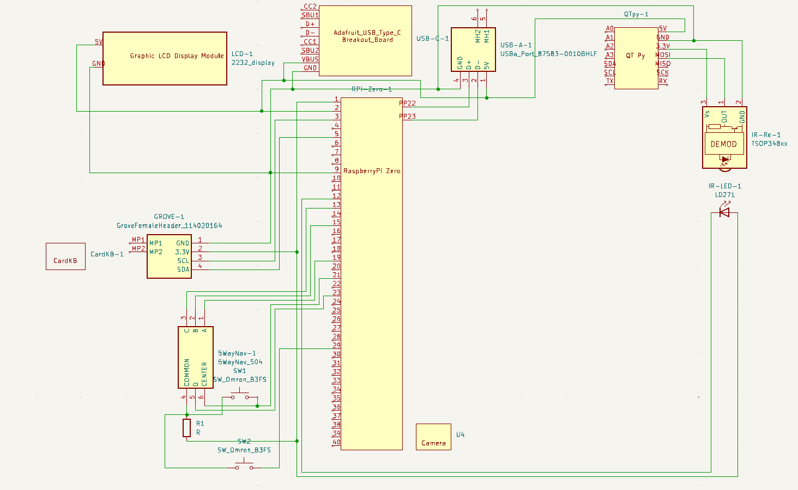
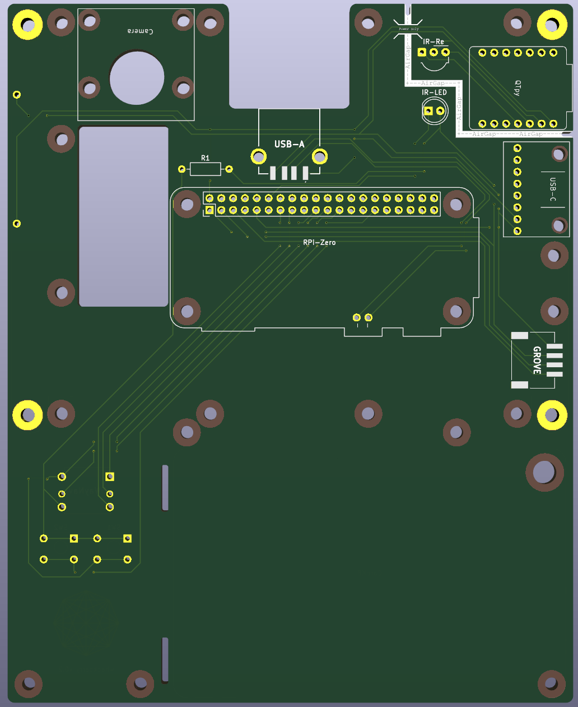

# WhackberryPi
Disconnected Cyberdeck for password management.


## Features:
- Disconnected computer (with display) with no wireless connectivity on any part of the device
- QWERTY keyboard with access to most standard symbols
- A mouse for navigating the OS in GUI mode
- A additional Micro SD card reader that can be used to create backups of passwords for storage in a secure secondary location
- A Camera to take pictures that are unable to reach the internet (useful for QR backup codes of 2FA apps)
- A disconnected microcontroller that is able to transmit data from the disconnected computer to another computer using a data diode

## How the data diode works:
1. The disconnected computer has a special command for transmitting data (`ir-sender`). This program can take standard input in bash.
2. The program encrypts the input. *NOTE* that the hardware only suport very weak and out-of-date encryption. Although it may provide a small layer of security, it should not be relied upon. This means anyone able to read the IR led blinking from inside the case, may be able to eventually decypt the messages. This seems like a low-level risk.
3. The program break the message into packets then into pulses and used the IR LED light transmit the password. Since there is no way to read messages from the LED, this is a one way communication. This is the data diode and it uses the "fire and forget" principle. This means errors in reading the message is possible. A check sum is part of the protocol to account for this possible error.
4. On the other side of the LED there is a IR Reciever. It is connected to a microcontroller that is completely disconnected* from the raspberry PI. The only way to communicate is over the air-gap via IR (one way).
*Note that the microcontroller is connected via power (5v and Ground). This allows the disconnected computer to be powered when the microcontroller is pluged into a computer. This does technically open the possibility of side channel attacks. 
5. The signal is recieved, decapsulated, combined, and de-crypted. The checksum is verified before decryption and the process will only continue if the checksum and decryption are successful.
6. When plugged into a computer, the air-gapped microcontroller acts as a keyboard and the message recieved is transmitted as keystrokes to the computer.

# Setup:
To set up a device, follow the instructions in each section of this readme from top to bottom. 

## Main Hardware
- Raspberry Pi Zero v1.3 [link](https://www.adafruit.com/product/2885)
- M5 CardKB (v1.1)
- HDMI 5" Display [link](https://www.adafruit.com/product/2232)
- Raspberry Pi Camera Module 3 [link](https://www.adafruit.com/product/5657)
- Infrared LED [link](https://www.adafruit.com/product/387)
- Infrared Receiver Sensor [link](https://www.adafruit.com/product/157)
- QT Py RP2040 [link](https://www.adafruit.com/product/4900)
- At least 1 micro CD card
- A Raspberry Pi with internet (for setup only)

## Supporting Hardware and PCB Mounting / cable accessories
- SMD Grove Female Header [link](https://www.mouser.ca/ProductDetail/Seeed-Studio/114020164?qs=7MVldsJ5Uayw%2FOfizq4F8w%3D%3D)
- USB Type-A Jack [link](https://www.mouser.ca/ProductDetail/Amphenol-FCI/87583-0010BHLF?qs=HGI6s9c03KdFNxR4%2F7F3Vg%3D%3D)
- HDMI cable [link1](https://www.adafruit.com/product/3552) [link2](https://www.adafruit.com/product/3549) [link3](https://www.adafruit.com/product/3561)
- Thru-hole 5-way Navigation switch (used as a mouse) [link](https://www.adafruit.com/product/504)
- 2x Buttons [link](https://www.adafruit.com/product/367)
- Pogo pins [link](https://www.adafruit.com/product/5381)
- Stand-off screws (the camera module may require a different size) [link](https://www.adafruit.com/product/3299)
- 1x 10k resistor [link](https://www.adafruit.com/product/2784)
- Male-male pin headers [link](https://www.adafruit.com/product/3009)
- USB Type C Breakout Board [link](https://www.adafruit.com/product/4090)
- SD card reader - SanDisk MobileMate USB 3.0 Reader [link](https://shop.sandisk.com/en-ca/products/accessories/memory-card-readers/sandisk-quickflow-microsd-usb-a-memory-card-reader?sku=SDDR-B731-GN6NN)
- One M4 nut and bolt (to attach CardKB)
- Solder and an soldering iron

## PCB
There PCB (Printed Circuit Board) design is included in this repository. This can be ordered online for a PCB manufacturer. If you want to forgo the case, you can order 2 boards and use the second with the one with standoffs to protect the device. 

**Schematic**


**Design view**


**Front view**


**Back view**


## Assembly guide

This guide assumes you have some experince with soldering. Locational references (up, down, left, right) assume the PCB is upright with the logo facing you. The logo side is the front of the board, the other side is the back. 
### Prepare parts
1. Break the Male-male pin headers into 2 7 pin pieces and 1 8 pin piece
2. Solder the QTpy to the two 7 pin headers with the pins facing away from the side with the USB port on it.
3. Repeat the previous step for the Raspberry Pi Zero, and USB-c Breakout board. 
4. Break the POGO pins into 2 single pins and 1 pieces with 2 still attatched pins.

### Attach USB-c Breakout board
1. Use a M2.5 hex nut as a space between the USB-c breakout board and the main PCB, with the USB-c breakour board on the back of the main PCB. Secure the breakout board in place with more M2.5 nuts and screws
2. Clip of excess pin length from the pins of the USB-c breakout board headers and then solder the pins in place

### Attach QTpy
1. Place the QTpy in place on the back of the main PCB
2. Clip of excess pin length from the pins of the QTpy headers and then solder the pins in place

### Attach Raspberry Pi Zero
1. Solder the 2 attached pogo pins below the main headed pins in the Raspberry Pi Zero footprint. The pins should be facing the back of the board
2. Use 6mm long F-F hex standoffs and screws to attach the Raspberry Pi Zero fo the back of the main PCB. The pogo pins should be making contect with the Raspberry Pi Zero, and the main header pins should slightly protrude through the main PCB. 
3. Solder all the main header pins into place.

### Other soldered-in pieces
1. Solder the GROVE Female Header onto the back of the main PCB
2. Solder the USB Type-A Jack onto the back of the main PCB
3. Insert the 5-way nav switch on the front of the PCB and solder in the pins
4. Repeat step above for both buttons below the 5-wav nav switch
5. Insert the Resistor on the back of the main PCB, clip excess pin lenth, and solder into place
6. Repeat step above for the IR-Reciever and the IR LED

### Attach the camera module
1. The mounting holes on the camera module are slightly smaller than M2.5 screws. You will either need to largen the holes are buy different hardware.
2. Use 6mm long F-F hex standoffs to attatch the camera to the back of the main PCB

### Attach CardKB
1. Use the M4 nut and bolt to attach the CardKB to the front of the main PCB

### Cables
1. Connect the Camera module to the Raspberry Pi Zero
2. Connect the CardKB to the main PCB GROVE header
3. Use the DYI HDMI cable to connect the display to the Raspberry Pi Zero

### Protection plate
Only do this if you are not making a 3D printed case
1. Choose 4 or 5 well distributed, unused, and accessible mounting holes and insert into each a M2.5 10mm Screw into an unused PCB (with nothing else solder or attached to it)
2. To the back of each of the screws, screw on a 6mm long F-F hex standoff untill snug
3. To the still protruding screws, screw on a 8mm long F-F hex standoff untill snug
4. Place the this PCB on the main on being careful not to pitch any cables
5. Screw the two boards together with M2.5 4mm Screws into the standoffs


## Setup guide

### 1.00: SD card setup
This part can be done on any trusted computer connected to the internet
1. Download Official Raspberry Pi Imager
2. Select Legacy, 32-bit - Debian Bullseye (released 2024-10-22)
3. Flash the SD card and then access the files on the SD card
4. Set up the display
   1. Setup the display. Under `bootfs > config.txt` if accessing from a SD Card reader or `\boot\config.txt` if accessing from the OS, add the following lines (more info [here](https://learn.adafruit.com/adafruit-5-800x480-tft-hdmi-monitor-touchscreen-backpack/raspberry-pi-config))
       ```
       hdmi_group=2
       hdmi_mode=87
       hdmi_cvt=800 480 60 6 0 0 0
       hdmi_drive=1
       max_usb_current=1
       ```
   2. Enable i2c. In the same `config.txt` file, uncomment "dtparam=i2c_arm=on". Follow instructions [here](https://raspberrypi.stackexchange.com/questions/83457/can-i-enable-i2c-before-first-boot)

### 2.00: Configure the OS
I suggest doing the configuartion from another pi with internet. Plug the SD card into a internet-connected Raspberry Pi and boot it. Follow the commands to set up your account and apply any updates. You can use a less secure password if you want, the more import one will be the one you use when setting up a GPG key. Reboot the device.

#### 2.01: Enable i2c
1. In terminal type, `sudo raspi-config`
2. `Interface Options > I2C > Yes  (enable) > OK > Finish`

#### 2.02: Turn on boot to terminal by default (optional)
1. In terminal type, `sudo raspi-config`
2. `System Options > Boot / Auto login > Console Autologin > Finish`
3. In subsequent boots, if you want a GUI, enter `startx` into the terminal

#### 2.03: Updrade all apps / install new apps
1. In teminal: `sudo apt update && sudo apt full-upgrade`
2. Install password manager `sudo apt-get install pass`
3. Install password manager GUI `sudo apt-get install qtpass`
4. Install a game (helpful for using the system to build up randomness) `sudo apt-get install ninvaders`
5. Install 7z for secure ziped exports: 'sudo apt-get install p7zip-full'
6. Install circuit python: `sudo pip3 install adafruit-blinka`
7. Install PyUserInput for mouse: `sudo pip3 install PyUserInput pynput`
8. Install web3 for ethereum wallet generation: `sudo pip3 install web3`


#### 2.04: Install Electum
1. Go to [https://electrum.org/#download](https://electrum.org/#download)
2. `mkdir ~/electrum`, then `cd ~/electrum`
3. Follow the instructions for "Installation from Python sources" (tested with version 4.5.8)

#### 2.05: Copy Etherium wallet script
1. `mkdir ~/cryptowallet`
2. Copy `cryptowallet/gen-eth-wallet.py` from this repo to `~/cryptowallet/gen-eth-wallet.py` on the raspberry pi
3. `chmod +x gen-eth-wallet.py`

#### 2.06: CarKB setup
1. `mkdir ~/cardkb`, then `cd ~/cardkb`
2. Follow instructions [here](https://github.com/ian-antking/cardkb) (Note: add `sudo` to `modprobe uinput`)

#### 2.07: Camera Setup
- Just plug and play
- `libcamera-hello` to test
- `libcamera-jpeg -o /path/to/file.jpg` to take a picture

#### 2.08: Set up 5-way navi mouse
1. `mkdir ~/navmouse`, then `cd ~/navmouse`
2. Copy `navmouse/mouse.py` and `navmouse/navmouselauncher.sh` from this repo to `~/navmouse` on the raspberry pi
3. `chmod +x *`
4. 'sudo nano /etc/xdg/lxsession/LXDE-pi/autostart`
5. Add this line to the end of the file, then save and exit: `@/home/{name of user}/navmouse/navmouselauncher.sh`
TODO: Fix this section

#### 2.09: Infrared Transmitter
1. Create a RAM disk for storing output:
   1. Add `newramdisk  /mnt/ramdisk  tmpfs  rw,size=8M  0  0` to `/etc/fstab` (*Note, you must replace each set of spaces with a tab*)
2. Configuration
   1. `sudo nano /boot/config.txt`
   2. Add a line with `dtoverlay=gpio-ir-tx,gpio_pin=18` to the file, then save and exit
   3. `sudo nano /etc/modules`
   4. Add a line with `lirc_dev` to the file, then save and exit
3. `mkdir ~/ir-sender`
4. Copy `ir-protocol/ir-sender` from this repo to the folder `~/ir-sender`
5. Copy `ir-protocol/ir-sender-gui` from this repo to the folder `~/Desktop/ir-sender-gui`
6. `chmod +x ~/ir-sender`
7. `chmod +x ~/Desktop/ir-sender-gui`
8. Add these lines `~/.profile`
   ```
   if [ -d "$HOME/ir-sender" ] ; then
   PATH="$PATH:$HOME/ir-sender"
   fi
   ```
9. Generate new key: `ir-sender --genkey`
10. Copy the contents of the json and use it when setting up the Infrared Reciever


#### 2.10: Infrared Reciever
This part of the device is on an isolated device that emulates a keyboard when plugged into the computer.
On a PC connected to the Pico
1. Download circuit python for the QTPy RP2040 ([link](https://circuitpython.org/board/adafruit_qtpy_rp2040/)) (I used CircuitPython 9.2.6)
2. Download the circuit python bundle ([link](https://github.com/adafruit/Adafruit_CircuitPython_Bundle/releases/tag/20250319)) (I used 'March 19, 2025 auto-release')
3. While holding down the `BOOT` button on the QTPy, connect it to the PC.
4. Copy the "uf2" file you downloaded in step 1 to the device. You should see `INDEX.HTM` and `INFO_UF2.TXT` there already. Wait for the device to reboot.
5. Unzip the folder from step 2 and copy the following folders and file to the `lib` folder of the QTPy.
   `adafruit_hid`, `adafruit_pixelbuf.mpy`, `neopixel.mpy`, `adafruit_rsa`, `adafruit_logging.mpy`, `adafruit_binascii`, `adafruit_hashlib` 
8. Copy the contents of the `ir-receiver-code.py` to `code.py`
9. Create a new file at the top level called `private_key.json` and put the json contents in it generated when setting up the Infrared Transmitter

#### 2.11: Copy over the utility scripts
1. `mkdir ~/utilities`
2. Copy `utilities/exportbackup.sh` from this repo to `~/utilities/exportbackup.sh` on the raspberry pi
3. Copy `utilities/importfromcsv.py` from this repo to `~/utilities/importfromcsv.py` on the raspberry pi
4. `sudo chmod +x ~/utilities/*`

#### 2.12: Test the system
1. Power down the raspberry pi you're using for setup. Move the SD card to the offline raspberry pi. 
2. Test the system to make sure all features work as expected

#### 2.12: Copy any passwords to the SD card
Copy password from any existing password managers to the SD Card (make sure to place them in a appropriate folder as not to mess up the OS on the SD Card).

### 3.00: Finish system init (offline) 
Only perform these steps when you're done setting up the device and ready to never connected to the internet again
1. If the SD card is still in the Raspberry Pi you were using for setup, move it to the offline Raspberry Pi Zero. 
2. Use system for 5-10 minutes to generate entopy (try `ninvaders`)
3. `mkdir ~/mydata`
4. Set up password manager
   1. Generate key
      1. `gpg --gen-key`
      2. Real name: user
      3. Email: [empty]
      4. `O` for okay
      5. Enter a password (this will be the master password for the password manager). Make sure it is a secure password and do not share it. 
      6. Note the id of the key. This will be a lond alphanumberic sequence right above "uid"
   2. Set key to never expire
      1. `gpg --edit-key key-id-as-noted-above`
      2. `expire`
      3. enter `0`
      4. `q` to quit (and `y` to save changes)
   2. `pass init key-id-as-noted-above`
5. Generate Bitcoin BTC wallet
   1. Start electrum with this command `~/electrum/Electrum-4.5.8/run_electrum`
   2. This application will run slowly. Be prepared to wait a few minutes between screens.
   3. Follow prompts and be sure to save the new seed to the password manager (`pass`)
   4. In the "Recieve" tab, create a never expiring request and save the public address to `pass` as well. You can use this to send money to the wallet.
6. Generate Etherium ETH wallet
   1. Run the command `python3 ~/cryptowallet/gen-eth-wallet.py`
   2. Enter both the private key and the public key to the `pass` password manager

## Using the system
**Basic commands**
- To start the GUI for the OS: `startx`

**Password manager**
- To add a password: `pass insert path/to/name`
- To generate a password: `pass generate path/to/name`
- To find a password: `pass find myaccount`
- To add metadata: `pass insert path/to/name.meta` (there are other oiptions, this is just a suggestion)
- To send a password to the QT py, `pass show path/to/name | ir-sender`
- To edit a password, `pass edit path/to/name`
- To use the password manager gui: `qtpass`

**Import csv to password manager**
1. Modify the script here: `~/utilities/importfromcsv.py` to match the fields in the CSV from your password manager
2. Run `python3 ~/utilities/importfromcsv.py /path/to/passwords.csv`
3. After successfully importing the passwords, delete the csv `rm /path/to/passwords.csv`

**Saving a encrypted image**
1. Take a picture `libcamera-jpeg -o /mnt/ramdisk/imagename.jpg` *note, raw image will not persist on reboot
2. Encrypt the image `gpg -e -r key-id-as-noted-above /mnt/ramdisk/imagename.jpg -o ~/mydata/imagename.jpg.gpg`

**Viewing a encrypted image**
1. Decrypt the image `gpg -d ~/mydata/imagename.jpg.gpg -o /mnt/ramdisk/imagename.jpg`
2. View the image here `/mnt/ramdisk/imagename.jpg` *note, image will not persist on reboot

**Creating a full backup**
This is meant to act as either an off site backup or a way to share all your data.
1. Safely procure a un-used micro SD card. This prevent any contamination of your disconnected system.
2. Create a backup. Run the script under `~/utilities/exportbackup.sh`
3. Follow the prompts
4. Copy the resulting file to the SD Card.

## Accessing cold wallets (online) 
1. Use `ir-sender` to send the target private key from the disconnected raspberry pi to a computer connect to the internet. Make sure to note any private keys or seeds being transfered. They are no longer totaly secure.
2. For Bitcion BTC:
   1. Download and install the Electrum application. Be very careful to download from the offical page (https://electrum.org/#download)[https://electrum.org/#download]
   2. Open the application and when prompted, select "Standard wallet" then "I already have a seed"
   3. Enter the seed for the Bitcoin BTC wallet.
   4. You can use the "Send" tab to send to any address. Start with a small amount to make sure everything is working.
3. For Etherium ETH:
   1. You can use any wallet that supports importing private keys to access the BTC. I'll include instructions for MetaMask Firefox Extension (v12.6.2) below.
   2. Go to MetaMask's site. Be sure it's the official source: [https://metamask.io/download/](https://metamask.io/download/)
   3. Download and lauch the extension
   4. Follow the propmts and select "create new wallet"
   5. Once on the main account page, click the account dropdown at the top of the screen
   6. Select "Add account or hardware wallet" then "Import account"
   7. Enter the private key for Etherium ETH.
   8. You can use the "Send" button to send to any address. Start with a small amount to make sure everything is working.

## Case
There is a 3D printable case included in this repository to help manage the cables and protect the devices. This case is yet to be printed and tested, so it likely we need to be altered and iterated. 

**Front of case**


**Back of case**


## Future work
- setup HID to act as a security key
- fix tempermental QTpy


